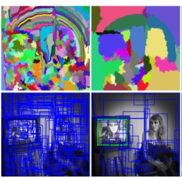
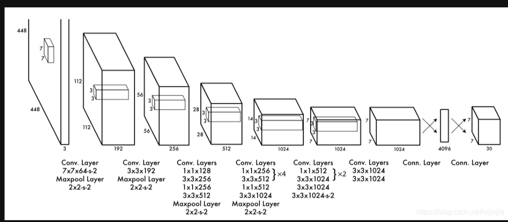
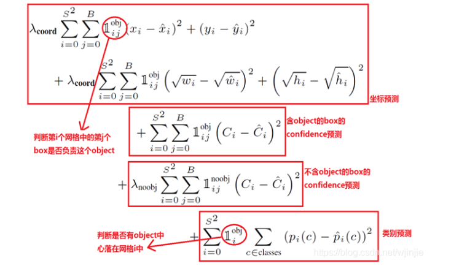
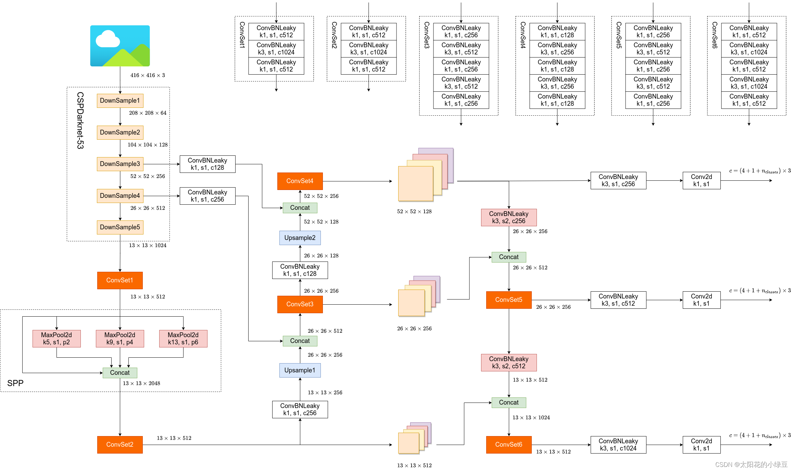

# Object Detection
四大类任务：分类（Classification）、定位（Location）、检测（Detection）、分割（Segmentation）
## 目标检测原理
### 产生候选区域
1. 滑动窗口
首先对输入图像进行不同窗口大小的滑窗进行从左往右、从上到下的滑动，每次滑动后执行分类器，得到较高得分时，认为找到物体。并且使用不同大小的窗口进行滑动，在查找的过程中使用NMS抑制（非极大值抑制）
> NMS抑制
> （1）将所有框的得分排序，选中最高分及其对应的框 
（2）遍历其余的框，如果和当前最高分框的重叠面积(IOU)大于一定阈值，我们就将框删除。（为什么要删除，是因为超过设定阈值，认为两个框的里面的物体属于同一个类别，比如都属于狗这个类别。我们只需要留下一个类别的可能性框图即可。）
（3）从未处理的框中继续选一个得分最高的，重复上述过程。

2. 选择性搜索（Selective Search）
选择搜索算法的主要思想：图像中物体可能存在的区域应该是有某些相似性或者连续性区域的。首先，对输入图像进行分割算法产生许多小的子区域。其次，根据这些子区域之间相似性(相似性标准主要有颜色、纹理、大小等等)进行区域合并，不断的进行区域迭代合并。每次迭代过程中对这些合并的子区域做bounding boxes(外切矩形)，这些子区域外切矩形就是通常所说的候选框。

## 目标检测算法
### R-CNN系列
1. R-CNN（region with CNN features）

$\quad$首先使用选择性搜索找出2000个RP（Region Proposal），然后需要对每个RP使用CNN提取出特征，考虑使用一个预训练的CNN网络（如AlexNet），需要注意的是由于不同RP需要进行Resize，还要先加上padding。由于从事的任务不同，最后的全连接层需要进行修改，根据一定的IOU划定正负样本，在选取minibatch训练时，按照一定的正负比进行选择（一般情况下负样本多于正样本）。  
$\quad$经过预训练和微调后的CNN网络不再变动，仅作为特征提取器，最后其实使用SVM进行分类操作，有几个类就使用几个SVM，在SVM分类过程中，IOU<0.3被作为负例，ground-truth（即完全框住了物体，默认IOU＞0.7时）是正例，其余的全部丢弃，然后SVM分类器也会输出一个预测的labels，然后用labels和truth labels比较，计算出loss，然后训练SVM。
> 一个细节：
> SVM由于是小样本训练，所以会存在负样本远多于正样本的情况。针对这种情况，作者使用了hard negative mining方法（初始时用所有样本训练，但是这样负样本可能远多王正样本，经过一轮训练后将score最高即最容易被误判的负样本加入新的样本训练集，进行训练，重复以上步骤至达到停止条件比如分类器性能不再提升），使得SVM适用于小样本训练，在样本不平衡时依然可以做到不会发生过拟合。

> 为什么使用SVM分类而不是使用CNN后的Softmax？
> 在训练CNN提取特征时，设置的IOU是0.5以上为正样本，小于0.5的是负样本。但在SVM分类中，只有bbox完全包围了物体（也可以理解为IOU＞0.7时）才是正样本，IOU小于0.3的是负样本。前者是大样本训练，后者是小样本训练。对于CNN的训练，需要大量的数据，不然容易过拟合，所以设置的阈值较低，比如一个bounding box可能只包含物体的一部分，那么我也把它标注为正样本，用于训练cnn；然而svm训练的时候，因为svm适用于少样本训练，所以对于训练样本数据的IOU要求比较严格，我们只有当bounding box把整个物体都包含进去了（IOU＞0.7），我们才把它标注为物体类别，IOU＜0.3的标注为负样本，然后训练svm。就因为这个特点，只能用低IOU来softmax分类，那么很可能导致最后的bbox框位置不准确（如果bbox和GT差距太大，通过线性回归会无法收敛），同时类识别精度也不高，根据实验MAP会下降几个百分点。如果硬要提高IOU，又会导致训练数据样本太少，发生过拟合。

$\quad$最后还需要进行候选区域的修正（Bounding Box Regression），即希望BBox更接近Ground Truth，BBox坐标形式$(x,y,w,h)$通过中心点确定候选框，希望把RP转化为GT，其实需要进行平移和缩放，使用四个函数来表示对于不同的输入需要进行怎样的变换操作（它们其实是关于输入特征向量的函数）可以将它们用一个函数表示
$$d_*(P)=w_*^T \phi_5(P)$$
$\quad$其中$w_*$就是可以学习的参数，$*$表示四个维度的变换中的任意一种。 
则$w_*$的损失函数即为简单的线性损失，再加上L2正则项。
> 在实现边界框回归时，作者发现了两个微妙的问题。首先，正则化很重要：我们基于验证集设置了λ=1000。第二个问题是，在选择使用哪个训练对(P，G)时必须小心。直观地说，如果P远离所有的地面真盒，那么将P转换为地面真盒G的任务就没有意义了。使用像P这样的例子会导致一个无望的学习问题。因此，我们只有当建议P靠近至少一个地面真值盒时，才能从它中学习。当且仅当重叠大于一个阈值（我们使用验证集将其设置为0.6）时，我们通过将P分配给地面真值框G（在它具有最大的地面真值重叠的情况下）来实现“接近性”。所有未分配的提案都将被丢弃。我们对每个对象类这样做一次，是为了学习一组特定于类的边界框回归变量。

2. Fast R-CNN

$\quad$中间有个SPPnet，改进之处在于只进行一次图像特征提取（而不是每个候选区域计算一次），然后根据算法，将候选区域特征图映射到整张图片特征图中。
> SSPnet的主要做法是，对于CNN初步提取特征的结果，将其分成$4*4、2*2、1*1$的区域，对每个区域进行Max-Pooling下采样，这样就在原本的512幅特征图的基础上得到了一个$21*512$的特征向量采用这个特征向量作为后续全连接层的输入（在卷积层和全连接层之间），它替代了一个池化层的位置，因此称为空间金字塔池化层（Spatial Pyramid Pooling Layer）。
而Fast R-CNN则使用了RoI（Region of Interest）的概念，RoI其实是SPP的简化版，它直接将不同维度的特征图下采样到一个固定的大小，而且它有一个较大的优势就是便于反向传播的训练过程。
> Fast R-CNN论文中提到：        
> 造成SPP层反向传播低效率的根本原因是每一个训练样本（例如RoI）均来自不同的图片，而我们知道反向传播需要用到正向传播过程中的数据，则导致需要存储的数据量巨大！   
> SPP-Net中fine-tuning的训练样本是来自所有图像的所有RoI打散后均匀采样的，即RoI-centric sampling，这就导致SGD的每个batch的样本来自不同的图像，需要同时计算和存储这些图像的Feature Map，过程变得expensive；Fast R-CNN采用分层采样思想，先采样出N张图像（image-centric sampling），在这N张图像中再平均采样出R个RoI，即每张图片采样出R/N个RoI，同一图像的RoI共享计算和内存。        
> 论文中举了一个例子说到：设N = 2， R = 128，也就是说只用计算和存储2张图像卷积正向传播过程中的数据，那么需要存储的数据量相比R-CNN和SPP小了64倍

$\quad$也就是说，SPP-Net中fine-tuning的样本是来自所有图像的所有RoI打散后均匀采样的，即RoI-centric sampling，这就导致SGD的每个batch的样本来自不同的图像，需要同时计算和存储这些图像的Feature Map，过程变得expensive.  Fast R-CNN采用分层采样思想，先采样出N张图像（image-centric sampling），在这N张图像中再采样出R个RoI，具体到实际中，N=2,R=128，同一图像的RoI共享计算和内存，也就是只用计算和存储2张图像，消耗就大大减少了。  
$\quad$Fast R—CNN的最终输出分成两部分，分别代表类别和位置标签，并提出了多任务损失函数(Multi-task Loss)，分类使用Softmax代替SVM，由于引入了类间竞争，因此效果更好。  
$\quad$另外，由于一张图像约产生2000个RoI，将近一半多的时间用在全连接层计算，为了提高运算速度，可以用SVD(奇异值分解)对全连接层进行变换来提高运算速度。一个大的矩阵可以近似分解为三个小矩阵的乘积，分解后的矩阵的元素数目远小于原始矩阵的元素数目，从而达到减少计算量的目的。

3. Faster RCNN

$\quad$Faster RCNN检测部分主要可以分为四个模块：  

>（1）conv layers。即特征提取网络，用于提取特征。通过一组conv+relu+pooling层来提取图像的feature maps，用于后续的RPN层和取proposal。有13个conv层，13个relu层，4个pooling层
conv：kernel_size=3，padding=1，stride=1
pooling：kernel_size=2，padding=0，stride=2  
（2）RPN（Region Proposal Network）。即区域候选网络，该网络替代了之前RCNN版本的Selective Search，用于生成候选框。这里任务有两部分，一个是分类：判断所有预设anchor是属于positive还是negative（即anchor内是否有目标，二分类）；还有一个bounding box regression：修正anchors得到较为准确的proposals。因此，RPN网络相当于提前做了一部分检测，即判断是否有目标（具体什么类别这里不判），以及修正anchor使框的更准一些。  
（3）RoI Pooling。即兴趣域池化（SPP net中的空间金字塔池化），用于收集RPN生成的proposals（每个框的坐标），并从（1）中的feature maps中提取出来（从对应位置扣出来），生成proposals feature maps送入后续全连接层继续做分类（具体是哪一类别）和回归。  
（4）Classification and Regression。利用proposals feature maps计算出具体类别，同时再做一次bounding box regression获得检测框最终的精确位置。

$\quad$RPN有两条线：上面一条通过softmax分类anchors获得positive和negative分类，下面一条用于计算对于anchors的bounding box regression偏移量，以获得精确的proposal。  
> 因此Faster RCNN本质上就是在Fast RCNN的cNN和IoR层之间增加了一条线路执行RPN
> 
$\quad$anchor意为锚点，用于预设位置，假设输入一张图片，经过前面骨干网络的一系列的卷积或者池化之后之后，得到一个尺寸 $m ∗ n$的特征图(暂且不说通道），对应将原图划分为$m ∗ n$个区域，原图的每个区域的中心由这个特征图上的一个像素点坐标表示。通过anchor机制，可以在每个像素点对应原图的区域生成k个可能存在目标的候选框（称为anchor box）（原文k=9）分别采用1：1、1：2、2：1的三层anchor。

$\quad$在原图找到对应anchor区域后，每个anchor生产成2个cls标签（表示属于任意检测目标类别/背景）和4个reg标签（表示位置）

$\quad$RPN的上一条线路就用来训练anchor的cls标签，通过$1*1$卷积层后得到大小为$m*n*18$的特征，即对每个像素点的9个anchor都输出两个概率值分别表示是背景还是检测目标的概率，然后通过一个softmax层进行概率的标准化，而resize是为了将输出维度的$2*9$中的9挪到另一维度上以便某维度只有2这两种类别方便进行softmax操作（这是多分类的情况，如果只是二分类，则只需要输出一个得分即可，它对应的损失函数也会有一定改变）；而reg标签就比较简单了，只需要每个anchor给出四个值即可。  
$\quad$之后的Proposal Layer需要综合前面的得到的概率和位置信息计算出精确的RP送入之后的RoI层，其中保留了一个参数im_info，它记录了之前CNN对于图像的变化，用于还原原本图像中的RP。  
最后使用全连接层提取最终特征，使用Softmax计算目标属于某一类别的概率，并计算出更精确的位置信息。

## YOLO系列
1. YOLO v1(2016CVPR)  

$\quad$核心思想是生成RoI+目标检测两阶段（two-stage）算法用一套网络的一阶段（one-stage）算法替代，直接在输出层回归bounding box的位置和所属类别，YOLO并没有真正去掉候选区，而是采用了预定义候选区的方法，也就是将图片划分为$7*7$个网格，每个网格允许预测出2个边框，总共$49*2$个bounding box，可以理解为98个候选区域，它们很粗略地覆盖了图片的整个区域。YOLO以降低mAP为代价，大幅提升了时间效率。
> 具体实现过程如下：  
(1) 将一幅图像分成 S×S个网格（grid cell），如果某个 object 的中心落在这个网格中，则这个网格就负责预测这个object。  
(2) 每个网格要预测 B 个bounding box，每个 bounding box 要预测 (x, y, w, h) 和 confidence 共5个值。  
(3) 每个网格还要预测一个类别信息，记为 C 个类。  
(4) 总的来说，S×S 个网格，每个网格要预测 B个bounding box ，还要预测 C 个类。网络输出就是一个 S × S × (5×B+C) 的张量。

在实际过程中，YOLOv1把一张图片划分为了7×7个网格，并且每个网格预测2个Box（Box1和Box2），20个类别。所以实际上，S=7，B=2，C=20。那么网络输出的shape也就是：7×7×30。

损失函数如下：

YOLOv1的问题：  
YOLOv1对相互靠近的物体，以及很小的群体检测效果不好，这是因为一个网格只预测了2个框，并且都只属于同一类；由于损失函数的问题，定位误差是影响检测效果的主要原因，尤其是大小物体的处理上，还有待加强。（因为对于小的bounding boxes，small error影响更大）
YOLOv1对不常见的角度的目标泛化性能偏弱。

2. YOLO v2  
   
backbone基于darknet19，相比于v1，主要的改进有：
①使用BN层处理常见梯度问题，不再使用dropout  
②使用低分辨率图像进行预训练后，再使用高分辨率图像进行微调  
③使用anchor机制，并且使用K-means聚类来选取anchor尺寸  
④使用Logisitic函数来约束对预测框的偏移估计，使得其不超出本身grid的范围  
⑤将前置的特征与最后的特征图连接，具体方式是将中间一层的一拆四再连接到最后一个卷积层输出的特征之后（在通道层面连接）  
⑥由于网络的下采样参数是32，因此输入图片往往选取32的倍数，yolov2美训练10个batch会选取一个新的size以实现更好的预测效果

3. YOLO v3

对于每一个目标预测出（4+1+80）个结果，其中位置信息会根据每个grid左上角点为基准进行计算

4. YOLO v3 SPP
   
Mosic图像增强：几张图拼在一起训练

SPP模块：
将原始输入经过多种maxpooling再拼接（$1*1、5*5、9*9、13*13$）

几种Loss：  
IoU Loss：$-ln(IoU)$ （不相交时始终为0）。  
GIoU Loss：$1-GIoU，GIoU = IoU-{A^c-u\over A^c}\in (-1,1)，A^c$为包住的大矩形面积，u为并的面积。  
DIoU Loss：$DIoU = IoU-{d^2\over c^2}$，d为两者中心距离，c为两者最远点距离，用它收敛更快。  
CIoU Loss：需要考虑的参数有重叠面积、长宽比、中心距离，因此提出
$CIoU = IoU - ({d^2\over c^2}+\alpha \nu)$  
$\nu = {4\over \pi^2}(arctan{w^{gt}\over h^{gt}}-arctan{w\over h})$(ground truth)  
$\alpha = {\nu \over{(1-IoU)+\nu}}$  
计算时将IoU换成DIoU更合理

Focal Loss：  
yolo这样的one-stage检测网络中有太多的负样本，要对于较难分别的负样本重点学习。

5. YOLO v4（CVPR2020）

backbone：CSPDark53，引入CSP模块

  
优化策略：  
Eliminate grid sensitivity: 
修改原有的限制，因为$\sigma$函数取0/1需要无穷大/小的值，因此将它替换成$2\sigma-0.5$。  
Mosaic data augmentation: 几张图片拼一起。  
IoU threshould：v3中只选取某一grid中符合阈值要求的anchor，现在在上左下右根据gt的中心选择各加一个，这样就考虑三个grid的anchor    
使用CIoU

6. YOLO v5

